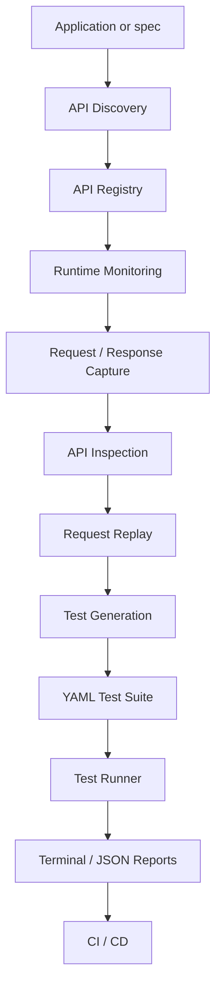
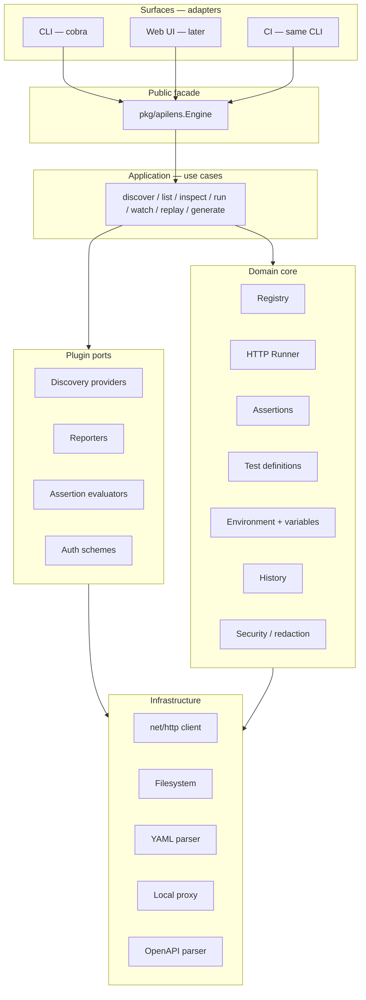
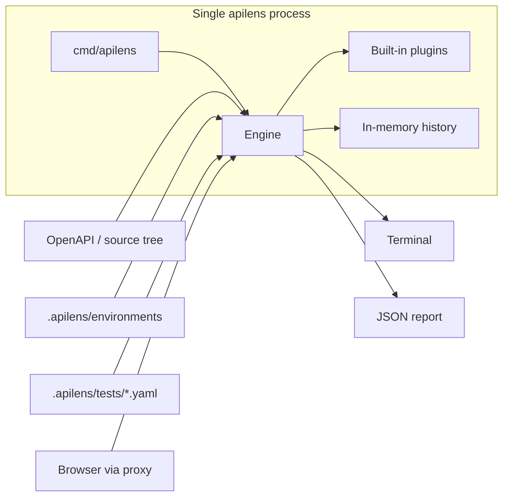
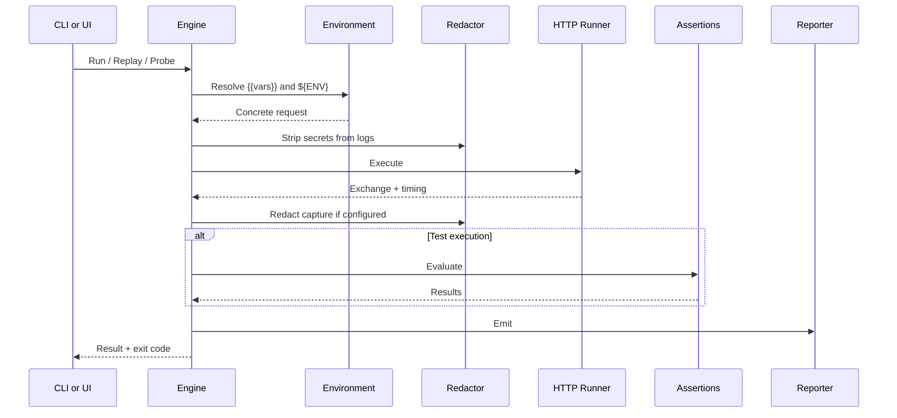
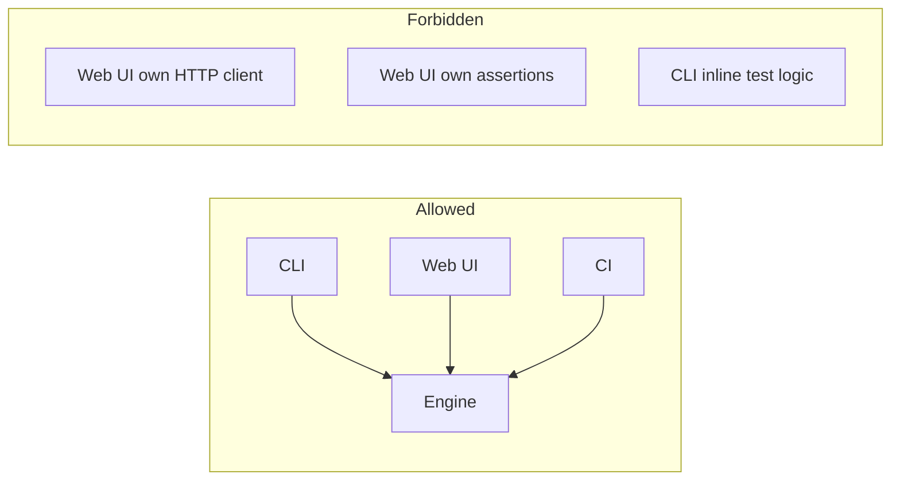
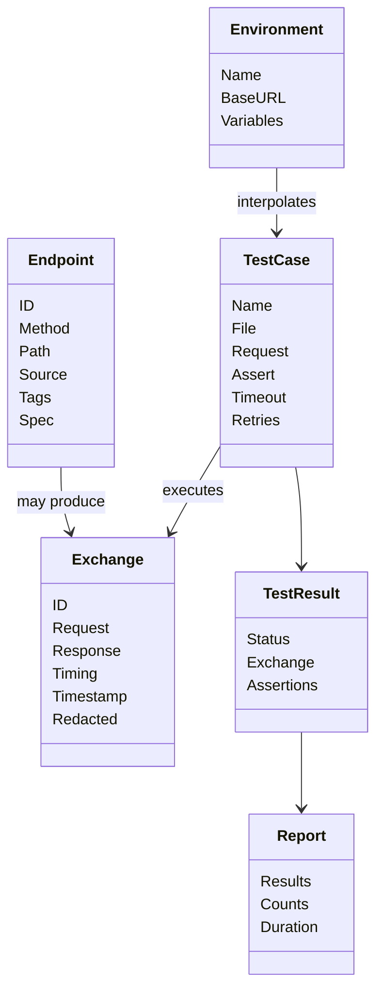

# 01 — Architecture

ApiLens is a **core engine** with thin surfaces around it.

The CLI, a future local web dashboard, and CI all call the same Go packages. They must not reimplement HTTP execution, assertions, discovery, replay, or reporting.

## 1. Product flow

Discovery and watch both feed the registry. Tests can also be written by hand. The runner never cares how a test was created.

## 2. Architectural style

**Hexagonal architecture (ports and adapters)** with a **compile-time plugin host**.

Rules:

- Surfaces contain no business logic.
- Domain types do not import CLI, proxy, or filesystem packages.
- New surfaces (HTTP API for the dashboard, editor integrations) only add adapters.
- New discovery sources, reporters, assertions, and auth schemes are plugins.

## 3. Design patterns in use

| Pattern | Where | Why |
| --- | --- | --- |
| Hexagonal / ports & adapters | Whole system | CLI and UI share one engine |
| Facade | `pkg/apilens.Engine` | One entry point for all surfaces |
| Strategy | Discovery, reporters, assertions, auth | Swap implementations without changing callers |
| Registry | API store + plugin host | Lookup by name / ID |
| Pipeline | Execute → redact → assert → report | Fixed test lifecycle |
| Observer | Proxy capture events | `watch` and future UI subscribe |
| Builder | HTTP request construction | Replay + request editor |
| Decorator | HTTP client | Timeout, retry, size limits |
| Factory | Reporter / provider construction | Config selects implementation |
| Specification | Assertions | Composable pass/fail rules |
| Adapter | CLI commands, future HTTP handlers | Map I/O onto use cases |

Avoid for MVP: Go `plugin` `.so` files, HashiCorp go-plugin, event-sourcing, a database, a custom RPC layer.

## 4. Runtime vs compile-time shape

MVP is one process. The proxy, history, and watch loop live in that process. History is in-memory until a later phase adds optional persistence.

## 5. Request execution pipeline

Every live HTTP call — `inspect --live`, `test`, `run`, `replay`, and proxy-forwarded traffic that we ourselves originate — goes through the same runner.

The proxy capture path is similar but skips assertions. It still runs redaction before history insert.

## 6. Use cases

| Use case | Input | Output | Phase |
| --- | --- | --- | --- |
| `Init` | Project root | `.apilens/` tree | 1 |
| `Discover` | Root + config | Endpoints in registry | 2 |
| `List` | Filters | Endpoint table | 2 |
| `Inspect` | Path / ID | Spec and/or last exchange | 2 |
| `RunSuite` | Filter + env | Report + exit code | 1 |
| `RunTest` | Path or file | Report + exit code | 1 |
| `Watch` | Bind address | Live exchange stream | 3 |
| `Replay` | History ID + overrides | New exchange | 4 |
| `Generate` | History ID | YAML test file | 4 |

Phase 1 implements `Init`, `RunSuite`, and `RunTest` against hand-written YAML. Discovery and watch come after the runner is trustworthy.

## 7. Shared engine rule

If a feature exists in the UI, it must already exist as an engine method. The UI is a renderer and an input form, not a second product.

## 8. Data the core understands

These types live in `internal/domain`. Plugins produce or consume them. Surfaces never invent parallel models.

## 9. Configuration precedence

Highest wins:

1. CLI flags
2. Process environment (`APILENS_*`, plus `${AUTH_TOKEN}` style secrets)
3. Selected environment file (`.apilens/environments/<name>.yaml`)
4. `.apilens/config.yaml`
5. Built-in defaults

Missing `{{variable}}` interpolation is a hard error. Fail closed rather than sending a literal `{{token}}` to a server.

## 10. What this architecture deliberately does not do

- It does not start as a hosted SaaS.
- It does not store a team-wide request database.
- It does not implement every web framework in Phase 1.
- It does not MITM every HTTPS site by default.
- It does not generate Go test files. Tests are YAML so QA and CI can edit them without compiling.

## 11. Success shape

A developer can:

1. `apilens init`
2. Write or generate tests
3. `apilens run` and get terminal + JSON output with exit code `0|1|2`
4. Later: `apilens discover` and see project APIs
5. Later: `apilens watch`, then `generate`, then `run`

If those paths share one runner and one assertion engine, the architecture is doing its job.
