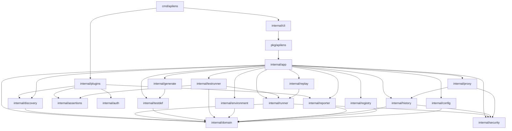

# 02 — Package and module boundaries

One Go module: `github.com/<org>/apilens` (name locked at first commit).

Implementation stays under `internal/` unless there is a strong reason to export it. The only public API is `pkg/apilens`.

## 1. Repository layout

```text
apilens/
├── cmd/
│   └── apilens/
│       └── main.go                 # wire plugins, run cobra
├── internal/
│   ├── domain/                     # types only — no I/O
│   ├── app/                        # use cases
│   ├── cli/                        # cobra commands — thin
│   ├── config/                     # load and validate config
│   ├── project/                    # init + .apilens layout
│   ├── registry/                   # endpoint store
│   ├── discovery/                  # orchestrator + Provider port
│   │   └── providers/
│   │       ├── openapi/
│   │       ├── graphql/
│   │       └── express/
│   ├── runner/                     # HTTP execution
│   ├── testdef/                    # YAML DSL parse + compile
│   ├── graphqlop/                  # GraphQL-over-HTTP parse/encode
│   ├── assertions/                 # evaluators + host
│   ├── testrunner/                 # suite orchestration
│   ├── environment/                # env files + interpolation
│   ├── security/                   # redaction / masking
│   ├── history/                    # in-memory exchange log
│   ├── proxy/                      # local forward proxy
│   ├── replay/                     # reconstruct + override
│   ├── generate/                   # exchange → YAML test
│   ├── reporter/                   # Reporter port + terminal/json
│   ├── auth/                       # auth schemes
│   └── plugins/                    # explicit built-in registration
├── pkg/
│   └── apilens/                    # public Engine facade
├── web/                            # Phase 5 — not started
├── examples/
├── testdata/
├── docs/
├── go.mod
└── README.md
```

`cmd/apilens` is allowed to import `internal/` and `pkg/apilens`. External importers can only see `pkg/apilens`.

## 2. Dependency direction



Hard rules:

- `internal/domain` imports only stdlib (and maybe small helpers like `uuid`).
- `internal/cli` does not call `runner`, `assertions`, or `proxy` directly.
- `internal/discovery/providers/*` do not import each other.
- `internal/proxy` does not import `testrunner` or `testdef`.
- No package imports `internal/cli` except `cmd/apilens`.

## 3. Package responsibilities

| Package | Owns | Must not own |
| --- | --- | --- |
| `domain` | Endpoint, Exchange, TestCase, Result, IDs | I/O, plugins, formatting |
| `app` | Use-case orchestration | Flag parsing, YAML schema details |
| `cli` | Cobra, stdout, exit codes | HTTP, assertions, discovery algorithms |
| `config` | `config.yaml` schema + validation | Test execution |
| `project` | `init` filesystem layout | Discovery |
| `registry` | Store / query endpoints | How endpoints were found |
| `discovery` | Provider port + merge/dedupe | Framework-specific parsing |
| `providers/openapi` | OpenAPI 3 / Swagger 2 | Express, registry persistence |
| `providers/graphql` | GraphQL SDL | OpenAPI, executing operations |
| `graphqlop` | Parse/encode GraphQL-over-HTTP | HTTP I/O, YAML |
| `providers/express` | Express route extraction | OpenAPI |
| `runner` | One HTTP exchange | Assertions, YAML |
| `testdef` | Parse and compile YAML | Execution |
| `assertions` | Evaluate compiled checks | HTTP |
| `testrunner` | Parallel/seq, retry, timeout | How a single request is sent (delegates) |
| `environment` | Env files, `{{var}}`, `${ENV}` | HTTP |
| `security` | Header/body redaction policy | Storage format |
| `history` | ID assignment, ring buffer | Proxy protocol |
| `proxy` | Listen, forward, emit captures | Test generation |
| `replay` | Apply overrides, call runner | Assertions |
| `generate` | Map exchange → YAML | Running the test |
| `reporter` | Format results | Deciding pass/fail |
| `auth` | Apply auth to a request | Redaction policy (uses security) |
| `plugins` | Wire built-ins | Business logic |
| `pkg/apilens` | Stable Engine methods | Cobra, file layout details |

## 4. Public facade

`pkg/apilens` is what the future dashboard and any integration import.

```text
Engine
  New(opts) (*Engine, error)
  Init(ctx, path) error
  Discover(ctx, opts) ([]Endpoint, error)
  List(filter) []Endpoint
  Inspect(ref) (*Inspection, error)
  Run(ctx, filter) (*Report, error)
  Watch(ctx, opts) (<-chan Exchange, error)
  Replay(ctx, id, overrides) (*Exchange, error)
  Generate(id, opts) (*GeneratedTest, error)
  History() []Exchange
  UseEnv(name) error
```

The CLI is a translation layer: flags → Engine → print.

If a method is awkward for the CLI, it is awkward for the UI too. Fix the Engine, not the command.

## 5. Project directory after `apilens init`

```text
.apilens/
├── config.yaml
├── tests/                      # recursive **/*.yaml
├── environments/
│   ├── local.yaml
│   └── staging.yaml
└── api/                        # discovered or imported specs
```

Later, optional and gitignored:

```text
.apilens/reports/
.apilens/history/
.apilens/environments/*.secrets.yaml
```

`init` writes a `.gitignore` snippet for those paths. It does not create a git repo. `<env>.secrets.yaml` is merged over `<env>.yaml` at load time; `apilens env show` still redacts secret keys.

## 6. Test layout in this repo

| Path | Purpose |
| --- | --- |
| `internal/<pkg>/*_test.go` | Unit tests next to code |
| `testdata/` | OpenAPI fixtures, YAML tests, capture samples |
| `examples/` | Small demo apps (Express, OpenAPI-only) |
| `tests/integration/` | Optional later — real HTTP against a local fixture server |

Do not put the product's `.apilens/tests` language tests inside `internal/`. Those are user artifacts.

## 7. Why not more packages

A package is added when it has a distinct reason to change.

- Do not split `runner` into `client`, `transport`, `timing` on day one.
- Do not create `internal/ui` until Phase 5.
- Do not create `pkg/discovery` — providers are not a public SDK yet.

If a file in `app` grows into a second use-case cluster, extract then — not before.
