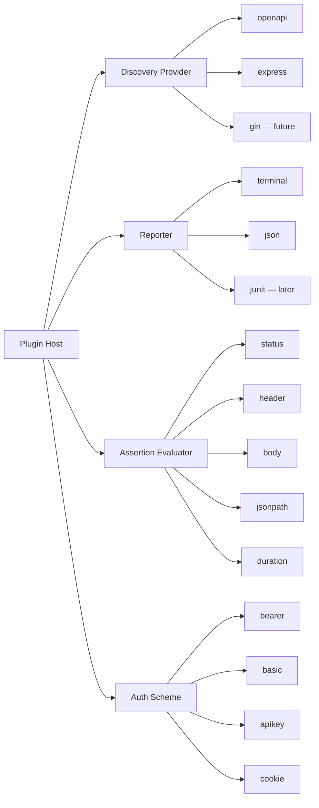
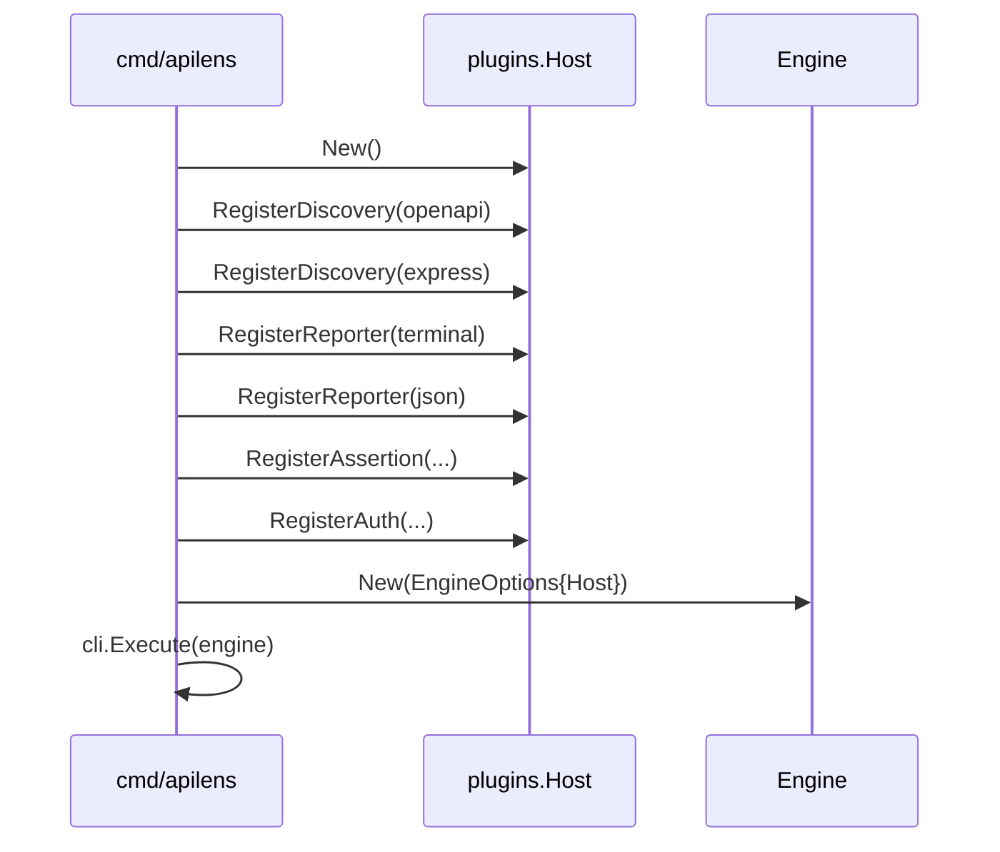

# 03 — Plugin architecture

ApiLens is plugin-oriented so discovery sources, reporters, assertions, and auth schemes can grow without rewriting the engine.

MVP plugins are **compile-time**: they implement a Go interface and are registered when the process starts. No `.so` loading. No subprocess RPC.

## 1. Why compile-time plugins

| Option | Verdict |
| --- | --- |
| Interface + explicit register | **Chosen.** Testable, simple, works everywhere. |
| `init()` auto-register | Rejected. Hidden wiring, harder tests. |
| Go `plugin` package | Rejected. Fragile, poor Windows/macOS story. |
| HashiCorp go-plugin | Deferred. Useful only if third parties must ship binaries. |

Third-party binary plugins can be added later without changing the ports. The host already talks to interfaces.

## 2. Plugin kinds



Four ports. Everything else stays in the core.

## 3. Host

```text
internal/plugins.Host
  RegisterDiscovery(Provider)
  RegisterReporter(Reporter)
  RegisterAssertion(Evaluator)
  RegisterAuth(Scheme)

  Discovery(name) (Provider, bool)
  Discoveries() []Provider
  Reporter(name) (Reporter, bool)
  Assertion(kind) (Evaluator, bool)
  Auth(kind) (Scheme, bool)
```

`cmd/apilens/main.go` constructs the host and registers built-ins. Tests construct a host with fakes.



## 4. Discovery provider contract

A provider answers two questions: "does this project look like mine?" and "what endpoints exist?"

```text
Provider
  Name() string
  Detect(ctx, root) (bool, error)
  Discover(ctx, root, opts) ([]Endpoint, error)
```

Rules:

- `Detect` is cheap. No network.
- `Discover` may read files. No unexpected network in MVP.
- Providers return domain `Endpoint` values. They do not write the registry.
- The orchestrator merges, dedupes, and stores.

Isolation: `providers/express` must not import `providers/openapi`. Shared helpers go in `discovery` or `domain`.

See [07-discovery.md](07-discovery.md).

## 5. Reporter contract

```text
Reporter
  Name() string
  Formats() []string          # "terminal", "json"
  Start(meta)
  TestFinished(result)
  SuiteFinished(report) error
```

The test runner owns pass/fail. Reporters only format.

Phase 1: `terminal`, `json`.
Phase 6: `junit`.
Later: `html`, `markdown`.

`--format json` selects the json reporter. Unknown format is a config error (exit 2).

## 6. Assertion evaluator contract

```text
Evaluator
  Kind() string               # "status.equals", "json.exists"
  Compile(raw) (Check, error)
  # Check.Eval(exchange) AssertionResult
```

YAML is compiled once, evaluated many times. Bad DSL is a config error before any HTTP call.

Built-in kinds for MVP are listed in [06-test-dsl.md](06-test-dsl.md). Schema, regex, and DB assertions register as new kinds later.

## 7. Auth scheme contract

```text
Scheme
  Kind() string               # "bearer", "basic", "apikey", "cookie"
  Apply(req, creds) error
```

Auth plugins only attach credentials. They do not log them. Display masking is always `security.Redactor`.

## 8. Built-in vs future plugins

| Kind | MVP built-ins | Later |
| --- | --- | --- |
| Discovery | `openapi` | `express`, gin, fiber, echo, nest, spring, django, aspnet |
| Reporter | `terminal`, `json` | `junit`, `html`, `markdown` |
| Assertion | status, header, body, json, duration | schema, regex, length, custom, db |
| Auth | bearer, basic, apikey, cookie | OAuth device flow, mTLS |

Framework providers ship in-tree first. An external provider interface can wait until someone needs it.

## 9. Config mapping

```yaml
discovery:
  openapi:
    enabled: true
    paths: []                 # empty = well-known filenames + limited walk
  graphql:
    enabled: true
    paths: []                 # empty = schema.graphql + limited walk
  express:
    enabled: false            # Phase 2

testing:
  reporter: terminal          # or json; --format overrides

auth:
  default: bearer
```

Disabled plugins are registered but skipped by the orchestrator. That keeps `Detect` from surprising users.

## 10. What is not a plugin

| Thing | Why it stays core |
| --- | --- |
| HTTP runner | One transport, one timing model |
| Variable interpolation | Must be consistent everywhere |
| Redaction | Security policy is not optional per plugin |
| History IDs | Identity must be global |
| Test runner scheduling | Parallel/retry/timeout is product behavior |
| Registry merge | Dedup rules must be central |

If a feature needs to see every exchange, it is core or an observer of history — not a fourth plugin kind.

## 11. Adding a provider later (example)

To add Gin discovery in a future phase:

1. Create `internal/discovery/providers/gin`.
2. Implement `discovery.Provider`.
3. Register it in `internal/plugins/builtin.go`.
4. Add `discovery.gin.enabled` to config.
5. Add testdata fixtures.
6. Do not touch `runner`, `assertions`, or the CLI except a filter flag if needed.

That is the whole point of the host.
