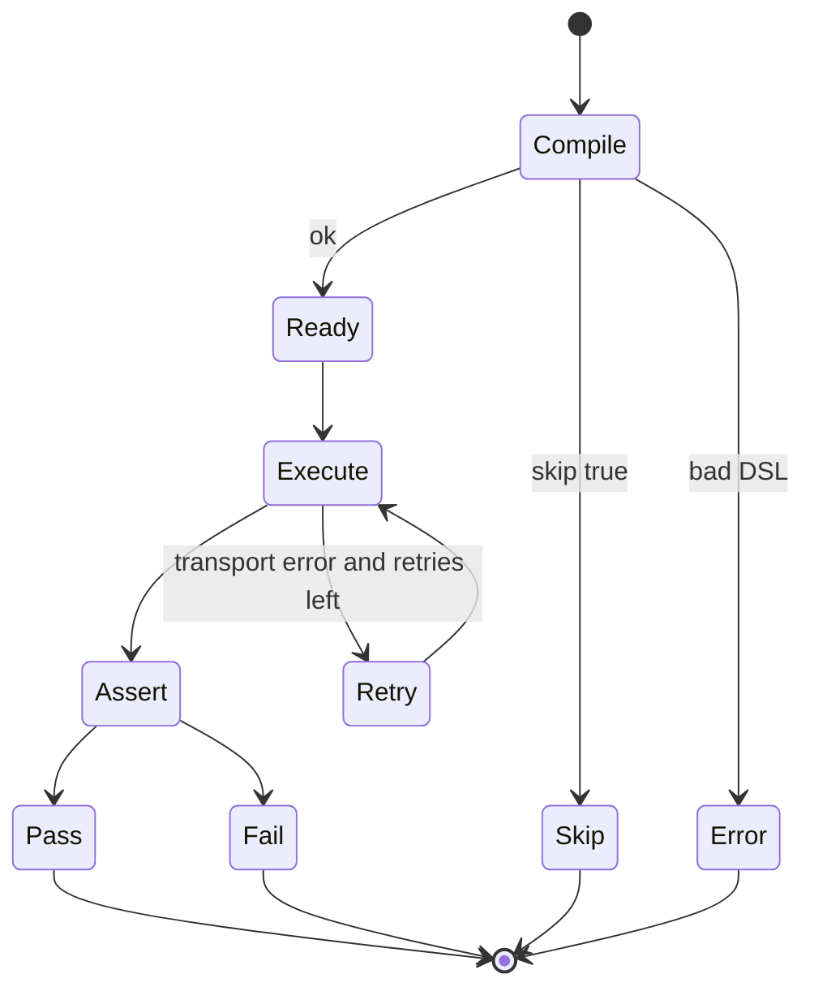

# 04 — Module interfaces

Interfaces are defined next to the consumer (idiomatic Go). Implementations live in sibling or child packages.

This file is the contract sheet. Names may tighten during implementation, but the shapes should not.

## 1. Domain identifiers

```text
EndpointID   # stable hash of method + normalized path + source
ExchangeID   # UUID internally
DisplayID    # monotonic int for humans: 42
EnvName      # "local", "staging"
TestRef      # file path or method+path
```

CLI and UI show `DisplayID`. Replay/generate accept `42` or `#42`. The engine maps that to the UUID for the current history session.

## 2. Discovery

```text
package discovery

type Provider interface {
    Name() string
    Detect(ctx context.Context, root fs.FS) (bool, error)
    Discover(ctx context.Context, root fs.FS, opts Options) ([]domain.Endpoint, error)
}

type Orchestrator interface {
    Discover(ctx context.Context, root fs.FS, opts Options) ([]domain.Endpoint, error)
}

type Options struct {
    Enabled []string          # provider names; empty = all enabled in config
    Paths   []string          # explicit spec/source paths
}
```

`fs.FS` keeps providers testable with `fstest.MapFS`.

## 3. Registry

```text
package registry

type Store interface {
    Replace(endpoints []domain.Endpoint) error
    Upsert(endpoint domain.Endpoint) error
    List(filter Filter) []domain.Endpoint
    Get(method domain.Method, path string) (domain.Endpoint, bool)
    GetByID(id domain.EndpointID) (domain.Endpoint, bool)
}

type Filter struct {
    Method string
    Path   string             # glob or prefix
    Tag    string
    Source string
}
```

MVP store is in-memory, optionally hydrated from the last discover write (`.apilens/api/registry.yaml`) so `list` works in a later invocation.

## 4. HTTP runner

```text
package runner

type Runner interface {
    Do(ctx context.Context, req domain.HTTPRequest) (domain.Exchange, error)
}

type HTTPRequest {
    Method  string
    URL     string            # already interpolated
    Headers http.Header
    Query   url.Values
    Body    []byte
    Timeout time.Duration
}
```

The runner:

- applies timeout
- records start/end
- enforces `max_response_size`
- does not retry (testrunner retries)
- does not assert
- does not log raw secrets (caller passes already-safe log views; runner may still see secrets on the wire)

## 5. Environment

```text
package environment

type Resolver interface {
    Use(name string) error
    Current() domain.Environment
    List() []domain.Environment
    Interpolate(s string) (string, error)
    InterpolateRequest(req testdef.RequestTemplate) (domain.HTTPRequest, error)
}
```

Resolution order for a variable: process env → environment file `variables` → `base_url` / built-ins.

`${AUTH_TOKEN}` in YAML is expanded from the process environment only. That is how secrets stay out of git.

## 6. Test definition

```text
package testdef

type Loader interface {
    LoadAll(root fs.FS) ([]domain.TestCase, error)
    LoadFile(path string) (domain.TestCase, error)
}

type Compiler interface {
    Compile(doc Document) (domain.TestCase, error)
}
```

Loader walks `.apilens/tests/**/*.yaml`. Hidden files and `*.secrets.yaml` are skipped.

## 7. Assertions

```text
package assertions

type Evaluator interface {
    Kind() string
    Compile(node RawNode) (Check, error)
}

type Check interface {
    Eval(ex domain.Exchange) domain.AssertionResult
}

type Engine interface {
    Compile(assert testdef.AssertBlock) (domain.AssertionSet, error)
    Eval(set domain.AssertionSet, ex domain.Exchange) []domain.AssertionResult
}
```

`Eval` never panics on unexpected JSON. It returns a failed assertion with a reason.

## 8. Test runner

```text
package testrunner

type Runner interface {
    Run(ctx context.Context, tests []domain.TestCase, opts Options) (domain.Report, error)
}

type Options struct {
    Parallel bool
    Workers  int
    Retries  int
    Timeout  time.Duration    # default per test
    FailFast bool
}
```

Per-test lifecycle:



A transport error after retries is `error`, not `fail`. `fail` means the request completed and an assertion did not hold. Exit code 1 covers both `fail` and `error` from tests. Exit code 2 is reserved for config/runtime problems before the suite is meaningful.

## 9. Reporter

```text
package reporter

type Reporter interface {
    Name() string
    Start(meta domain.SuiteMeta)
    TestFinished(result domain.TestResult)
    SuiteFinished(report domain.Report) error
}
```

Terminal reporter writes incrementally. JSON reporter may buffer and write once in `SuiteFinished` so the document is valid.

## 10. History

```text
package history

type Store interface {
    Append(ex domain.Exchange) domain.Exchange   # assigns IDs
    Get(displayID int) (domain.Exchange, bool)
    GetUUID(id domain.ExchangeID) (domain.Exchange, bool)
    List(limit int) []domain.Exchange
    Clear()
}
```

MVP: in-memory ring buffer. Default capacity is configurable (`history.max_entries`, default 1000). Oldest dropped first.

## 11. Proxy

```text
package proxy

type Proxy interface {
    Start(ctx context.Context, opts Options) error
    Events() <-chan domain.Exchange
    Addr() string
}

type Options struct {
    Bind            string    # default 127.0.0.1:8888
    MITM            bool      # default false
    MaxResponseSize int64
    Filter          Filter    # optional host/path allowlist
}
```

The proxy never starts on `0.0.0.0` unless `Bind` is explicitly set to a non-loopback address. That check lives in `app` + `security`, not only in docs.

## 12. Replay and generate

```text
package replay

type Service interface {
    Replay(ctx context.Context, id int, ov Overrides) (domain.Exchange, error)
}

type Overrides struct {
    Method  *string
    URL     *string
    Headers map[string]string    # set/replace
    Unset   []string             # remove headers
    Query   map[string]string
    Body    []byte
}

package generate

type Service interface {
    FromExchange(ex domain.Exchange, opts Options) (Generated, error)
}

type Generated struct {
    Path    string
    Content []byte
    Test    domain.TestCase
}
```

Generate writes under `.apilens/tests/<tag-or-path>/<slug>.yaml` and does not overwrite without `--force`.

## 13. Security

```text
package security

type Redactor interface {
    Headers(h http.Header) http.Header
    Body(contentType string, body []byte) []byte
    DisplayHeaders(h http.Header) http.Header
}

type Binder interface {
    ValidateListenAddr(addr string) error
}
```

`DisplayHeaders` is what reporters print. `Headers`/`Body` are what history stores when `capture_sensitive_headers` is false.

## 14. Engine facade

```text
package apilens

type Engine interface {
    Init(ctx context.Context, path string) error
    Discover(ctx context.Context, opts DiscoverOptions) ([]domain.Endpoint, error)
    List(filter registry.Filter) []domain.Endpoint
    Inspect(ctx context.Context, ref InspectRef) (*Inspection, error)
    Run(ctx context.Context, filter RunFilter) (*domain.Report, error)
    Watch(ctx context.Context, opts WatchOptions) (<-chan domain.Exchange, error)
    Replay(ctx context.Context, id int, ov replay.Overrides) (*domain.Exchange, error)
    Generate(id int, opts generate.Options) (*generate.Generated, error)
    History() []domain.Exchange
    UseEnv(name string) error
}
```

Surfaces depend on this interface, not on concrete internals. The concrete type lives in `pkg/apilens` and composes `internal/app`.

## 15. Cross-cutting error types

```text
ErrConfig      # bad YAML, missing env, unknown format → exit 2
ErrNotFound    # unknown test, endpoint, history id → exit 2
ErrSecurity    # bind denied, secret policy → exit 2
ErrTransport   # after retries, recorded as test error → exit 1 if in suite
```

CLI maps these in one place (`internal/cli/exit.go`). Commands do not invent their own codes.
