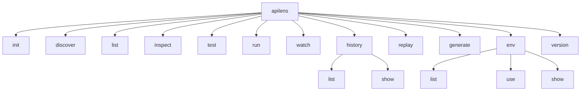

# 05 — CLI design

Binary name: `apilens`.

The CLI is the primary surface. It is a thin adapter over `pkg/apilens.Engine`.

Use Cobra + `spf13/pflag`. Global flags are persistent on the root command.

## 1. Command tree



`ui` is reserved for Phase 5 and is not implemented in the MVP.

## 2. Global flags

| Flag | Env | Default | Purpose |
| --- | --- | --- | --- |
| `--project` | `APILENS_PROJECT` | `.` | Project root containing `.apilens/` |
| `--env` | `APILENS_ENV` | current / `local` | Environment name |
| `--config` | `APILENS_CONFIG` | `.apilens/config.yaml` | Config path |
| `--format` | `APILENS_FORMAT` | `terminal` | `terminal` or `json` |
| `--quiet` | | false | Errors only |
| `--verbose` | | false | Debug logs (still redacted) |

`--format json` applies to `run`, `test`, `list`, `discover`, `inspect`, and `history`. Human-only commands (`watch` live view, `init`) ignore it or print a machine event stream later.

## 3. Commands

### `apilens init`

Creates the `.apilens/` tree if missing. Refuses to overwrite `config.yaml` unless `--force`.

```text
.apilens/config.yaml
.apilens/tests/.gitkeep
.apilens/environments/local.yaml
.apilens/api/.gitkeep
```

Writes a short comment in `local.yaml` showing `base_url` and `${AUTH_TOKEN}`.

### `apilens discover`

Runs enabled discovery providers and upserts the registry.

```text
apilens discover
apilens discover --source openapi
apilens discover --path ./openapi.yaml
```

Terminal output:

```text
API DISCOVERY

GET     /api/users                 openapi
POST    /api/users                 openapi
GET     /api/users/:id             openapi

Found: 3 APIs
```

JSON: `{ "endpoints": [...], "count": 3 }`.

### `apilens list`

Reads the registry. If empty, prints a hint to run `discover`. Does not rediscover implicitly.

```text
apilens list
apilens list --method GET
apilens list --tag users
```

### `apilens inspect <ref>`

`ref` is a path (`/api/users`) or endpoint ID.

| Flag | Meaning |
| --- | --- |
| `--method` | Required when multiple methods share the path |
| `--live` | Execute a probe request through the runner |
| `--last` | Show the last matching history exchange if present |

Default (no `--live`): show registry spec — method, path, parameters, available schema, source.

This resolves a spec gap: inspect is useful before any traffic exists.

### `apilens test <ref>`

Runs tests that match `ref`.

`ref` may be:

- a URL path: `/api/users`
- a test file: `.apilens/tests/users/get-user.yaml`
- a test name: `Get User`

```text
apilens test /api/users
apilens test /api/users --method GET
apilens test .apilens/tests/users/get-user.yaml
```

If several tests match, all of them run (a filtered suite).

If none match: exit 2, tell the user to write a test or `apilens generate`.

Do **not** silently fire an unasserted probe. That would blur `inspect --live` and `test`.

### `apilens run`

Runs the full suite under `.apilens/tests`.

```text
apilens run
apilens run --env staging
apilens run --format json
apilens run --filter smoke
apilens run --parallel
apilens run --sequential
apilens run --fail-fast
```

`--filter` matches test name, tag, or path substring.

Default parallel/sequential comes from `testing.parallel` in config. Flags override.

Sample terminal output:

```text
API TEST RESULTS

✓ GET    /api/users             200    82ms
✓ GET    /api/users/1           200    91ms
✓ POST   /api/users             201   143ms
✗ DELETE /api/users/1           500   218ms
    status.equals: expected 204, got 500

Tests:    4
Passed:   3
Failed:   1
Success:  75%
```

### `apilens watch`

Starts the local proxy and prints exchanges as they arrive.

```text
apilens watch
apilens watch --port 8888
apilens watch --bind 127.0.0.1:8888
apilens watch --filter /api
```

```text
API WATCHER

Listening on 127.0.0.1:8888
Set HTTP_PROXY=http://127.0.0.1:8888

#1  GET   /api/profile           200    81ms
#2  GET   /api/dashboard         200   132ms
#3  POST  /api/analytics         201   105ms
```

Ctrl+C stops the proxy and drops in-memory history. Say that in the banner so users generate tests before quitting.

### `apilens history`

Session helper for watch/replay.

```text
apilens history list
apilens history show 42
```

Only meaningful while history exists. In MVP that means the same process — so `history` is most useful as a subcommand during `watch` **or** we persist a temp file for the session. Decision: Phase 3 writes an optional session file under `/tmp/apilens-history-<pid>.jsonl` so a second terminal can `replay` while watch is running. See [08-proxy.md](08-proxy.md).

### `apilens replay <id>`

```text
apilens replay 42
apilens replay 42 --method POST
apilens replay 42 --url http://localhost:5000/api/forms
apilens replay 42 --header "X-Debug: 1"
apilens replay 42 --unset Cookie
```

Replays through the runner. Prints a redacted inspect view. Does not write a test.

### `apilens generate <id>`

```text
apilens generate 42
apilens generate 42 --out .apilens/tests/forms/create-form.yaml
apilens generate 42 --force
```

Writes YAML with method, URL, safe headers, body (if non-sensitive), and `status.equals` on the captured status.

### `apilens env`

```text
apilens env list
apilens env use staging
apilens env show
apilens env show local
```

`use` writes `.apilens/.current-env` (gitignored). `--env` on any command overrides it for that invocation.

### `apilens version`

Prints version, commit, and build date. Needed for CI bug reports.

## 4. Exit codes

| Code | Meaning |
| --- | --- |
| 0 | Success. For `run`/`test`: all tests passed or skipped-only with no failures. |
| 1 | One or more tests failed or errored. |
| 2 | Usage, config, missing file, unknown id, security bind rejection, compile error. |

`discover` with zero endpoints is exit 0 plus a warning — empty can be valid. A broken OpenAPI file is exit 2.

## 5. Command → engine mapping

| Command | Engine method |
| --- | --- |
| `init` | `Init` |
| `discover` | `Discover` |
| `list` | `List` |
| `inspect` | `Inspect` |
| `test` / `run` | `Run` |
| `watch` | `Watch` |
| `replay` | `Replay` |
| `generate` | `Generate` |
| `env use` | `UseEnv` |
| `history` | `History` |

No command reaches `internal/runner` itself.

## 6. Help and tone

Short verbs. No ASCII art. No emoji in default output.

Secrets in verbose mode still pass through the redactor. `--verbose` is not a bypass.

## 7. Completion

Cobra completion (`apilens completion zsh`) is cheap and useful. Add it when the command tree is stable, not in the first skeleton PR.
