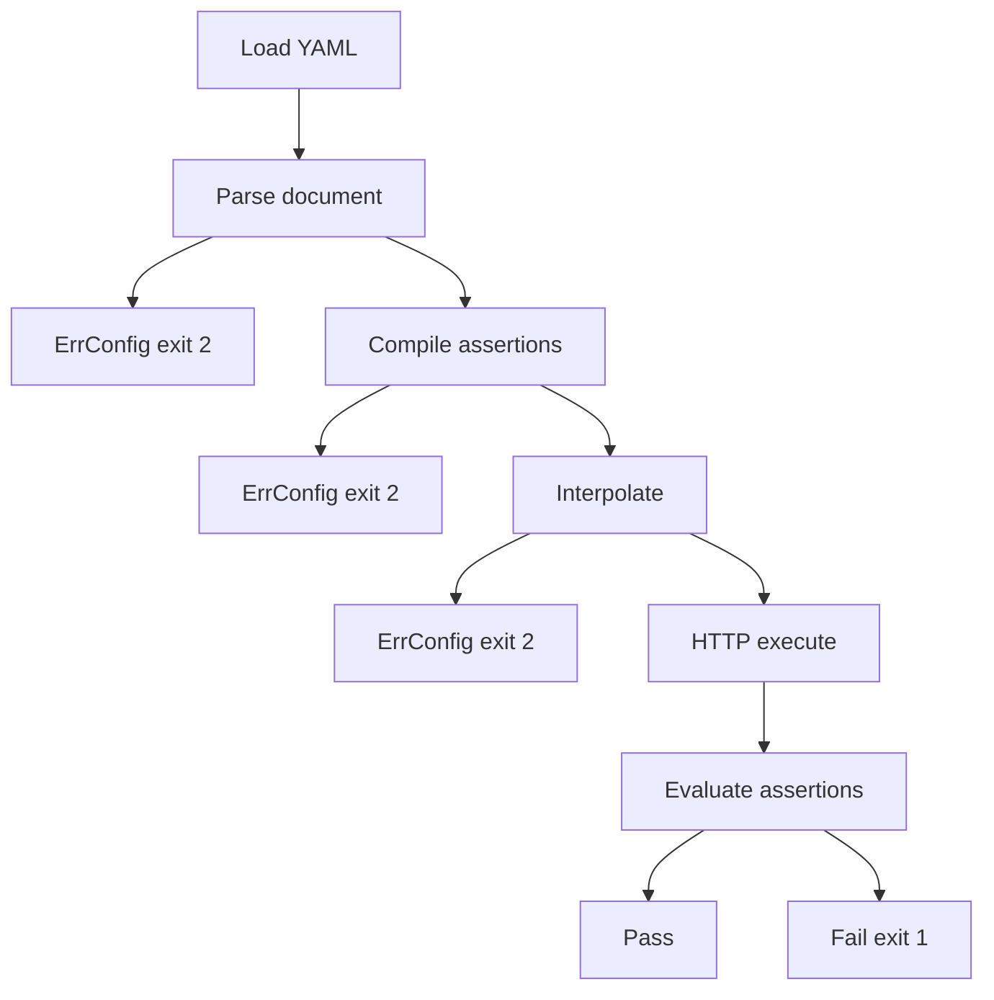

# 06 — Test DSL

Tests are YAML. Authors should not write Go.

The DSL is compiled to `domain.TestCase` once, then executed by the shared runner.

## 1. Design rules

- Versioned. Field `version: 1` is required once we ship; files without it are treated as v1 during MVP.
- One test per file for MVP. Suites are directories.
- Fail closed on unknown assertion keys and missing variables.
- No scripting. No JS hooks. No embedded Go.
- Interpolation uses `{{name}}`. OS secrets use `${ENV_NAME}` in environment files.

## 2. File layout

```text
.apilens/tests/
├── smoke/
│   └── health.yaml
└── users/
    ├── list-users.yaml
    └── get-user.yaml
```

`apilens run` loads `**/*.yaml` recursively.

## 3. Document schema (v1)

```yaml
version: 1
name: Get User
description: Fetch a single user by id
tags: [users, smoke]
skip: false

request:
  method: GET
  url: "{{base_url}}/api/users/{{user_id}}"
  headers:
    Accept: application/json
  query:
    include: profile
  body:
    json:
      unused: example
  auth:
    type: bearer
    token: "{{token}}"
  timeout: 10s

assert:
  status:
    equals: 200
    # not_equals: 500

  headers:
    content-type:
      contains: application/json
    x-request-id:
      exists: true

  body:
    contains: "id"
    not_contains: "error"

  json:
    success:
      equals: true
    data:
      exists: true
    data.id:
      exists: true
    data.email:
      contains: "@"

  duration:
    less_than: 1000          # milliseconds
```

`body.json` is serialized as JSON. Raw body uses `body.raw` plus optional `body.content_type`.

Do not allow both `json` and `raw` in the same test.

## 4. Minimal valid test

```yaml
name: Health
request:
  method: GET
  url: "{{base_url}}/health"
assert:
  status:
    equals: 200
```

This is also what `generate` emits, plus captured headers/body when safe.

## 5. Assertions — MVP

| Kind | YAML | Pass when |
| --- | --- | --- |
| `status.equals` | `assert.status.equals` | Status == n |
| `status.not_equals` | `assert.status.not_equals` | Status != n |
| `duration.less_than` | `assert.duration.less_than` | Duration ms < n |
| `header.exists` | `assert.headers.<name>.exists` | Header present |
| `header.equals` | `assert.headers.<name>.equals` | Exact match, case-insensitive name |
| `header.contains` | `assert.headers.<name>.contains` | Substring |
| `body.contains` | `assert.body.contains` | Raw body substring |
| `body.not_contains` | `assert.body.not_contains` | Raw body lacks substring |
| `json.exists` | `assert.json.<path>.exists` | Path present |
| `json.equals` | `assert.json.<path>.equals` | Deep equal |
| `json.contains` | `assert.json.<path>.contains` | String contains / array contains |

Header names in YAML are canonicalized to canonical MIME case for lookup.

## 6. JSON paths (MVP)

Dotted paths only:

```text
data
data.id
data.items.0
data.items.0.name
```

No `$`, no filters, no recursive descent. If the body is not JSON, every `json.*` assertion fails with `response is not JSON`.

This is enough for generate-and-edit. A real JSONPath library can become a plugin later without changing the runner.

## 7. Interpolation

In request fields (`url`, `headers`, `query`, `body`, `auth`):

```text
{{base_url}}     # from environment file
{{token}}        # from environment.variables or process env
{{user_id}}
```

Undefined `{{var}}` → compile/runtime config error (exit 2) before send.

Environment file:

```yaml
base_url: http://localhost:5000
variables:
  token: "${AUTH_TOKEN}"
  user_id: "1"
```

`${AUTH_TOKEN}` missing → error. Do not send an empty Authorization header silently.

Process environment overrides file values of the same key (`AUTH_TOKEN` or `token` — exact rule: OS env `APILENS_VAR_<NAME>` and conventional names listed in the env file). Simplest MVP rule:

1. Expand `${ENV}` in the environment file.
2. Overlay OS env vars that match variable keys (case-sensitive).
3. Overlay `base_url` from `APILENS_BASE_URL` if set.
4. Interpolate `{{name}}` in the test.

## 8. Auth in tests

```yaml
request:
  auth:
    type: bearer
    token: "{{token}}"
```

```yaml
request:
  auth:
    type: basic
    username: "{{user}}"
    password: "{{password}}"
```

```yaml
request:
  auth:
    type: apikey
    header: X-API-Key
    value: "{{api_key}}"
```

```yaml
request:
  auth:
    type: cookie
    name: session
    value: "{{session}}"
```

Auth plugins apply these to the request. Reporters print `Authorization: Bearer ********`.

Manual `headers.Authorization` is allowed. The redactor still masks it. Prefer `auth:` so generate and the future UI have a structured field.

## 9. Timeouts, retries, skip

| Field | Level | Default |
| --- | --- | --- |
| `request.timeout` | test | `testing.timeout` (10s) |
| `retries` | test or suite flag | `testing.retries` (1) |
| `skip` | test | false |

Retries apply to transport failures only, not assertion failures.

## 10. Generated test shape

`apilens generate 42` produces:

```yaml
version: 1
name: POST /api/forms
tags: [generated]
request:
  method: POST
  url: "{{base_url}}/api/forms"
  headers:
    Content-Type: application/json
    Accept: application/json
  body:
    json:
      title: Example
assert:
  status:
    equals: 201
```

Dropped by default: `Authorization`, `Cookie`, `Set-Cookie`, and configured sensitive headers. Body dropped if it looks like a login payload (keys `password`, `token`, `secret`, `client_secret`).

The author adds auth via the environment, not by pasting a live token into git.

## 11. Explicitly out of v1

- Multiple tests in one file
- `setup` / `teardown`
- Chaining (`{{response.0.id}}`)
- JS/Go scripts
- JSON Schema
- Regex
- Array length
- Database assertions
- GraphQL operation DSL

Chaining is the most requested follow-up. Design it as a later DSL version, not a silent v1 add-on.

## 12. Compile errors vs assertion failures



If the suite cannot be compiled, no HTTP traffic is sent.
