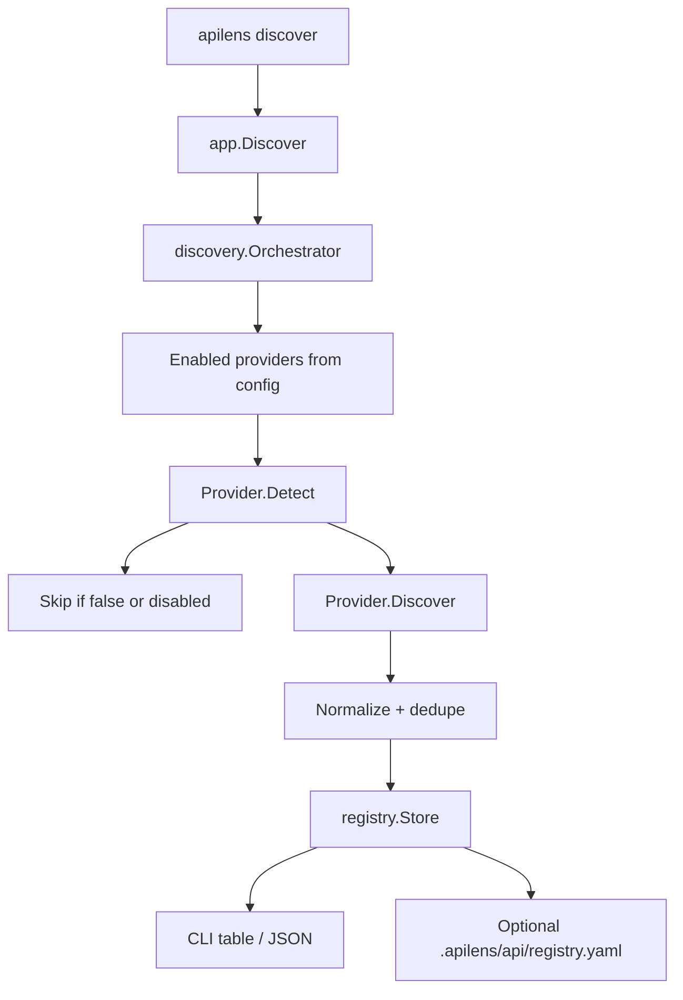
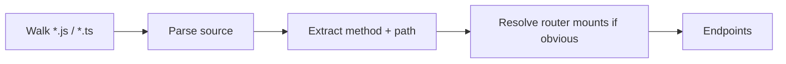

# 07 — API discovery architecture

Discovery is a first-class product feature. Users should not type every endpoint by hand.

The orchestrator talks only to `discovery.Provider`. Framework details stay inside provider packages.

## 1. Flow



Providers never write the registry. That keeps merge rules in one place.

## 2. Endpoint identity

An endpoint is uniquely identified by:

```text
normalize(method) + normalize(path) + source-priority
```

Path normalization:

- Strip trailing slash except `/`
- Convert Express/Gin `:id` and `{id}` to a canonical `:id`
- Lowercase host if present; paths keep case
- Drop query strings from the identity (queries are parameters, not the API)

If OpenAPI and Express both find `GET /api/users`, keep one endpoint and record both sources.

```text
Endpoint.Sources = ["openapi", "express"]
Endpoint.PrimarySource = "openapi"    # richer spec wins
```

Priority: `openapi` / `graphql` (tied) > framework AST > runtime watch.

Watch-discovered routes are "seen" endpoints. They enrich the registry but do not overwrite OpenAPI schemas.

## 3. Phase 1 provider — OpenAPI

Support:

- OpenAPI 3 (`openapi.yaml`, `openapi.yml`, `openapi.json`)
- Swagger 2 (`swagger.yaml`, `swagger.json`)

Recommended library: `kin-openapi` (or equivalent maintained parser). Do not write a YAML OpenAPI parser.

### Location strategy

1. Paths in `discovery.openapi.paths`
2. Well-known filenames in the project root and `.apilens/api/`
3. Limited walk: depth 4, skip `node_modules`, `vendor`, `.git`, `dist`, `build`, `.apilens/tests`

A 20k-file monorepo must not be fully walked by default.

### Mapping

| OpenAPI | Endpoint |
| --- | --- |
| `GET /users/{id}` | `GET /users/:id` |
| `operationId` | `Name` |
| `tags` | `Tags` |
| `parameters` | `Spec.Parameters` |
| `requestBody` | `Spec.RequestBody` |
| `responses` | `Spec.Responses` |
| `servers[0].url` | Hint only — `base_url` in env still wins |

Do not import vendor extensions unless needed. Do not try to execute examples as tests automatically in Phase 1.

## 4. Phase 2 provider — Express

Goal: find `app.get('/api/users', ...)` and `router.post('/:id', ...)` without running the app.



Strategy, in order of fidelity:

1. **Conservative regex / AST scan** for `app|router.(get|post|put|patch|delete|all)( path )`
2. Resolve `router.use('/api', userRouter)` when the target is a same-file or simple import
3. Give up on dynamic paths (`app[method](variable)`) and report them as skipped

This will be imperfect. That is acceptable if:

- we never invent endpoints that are not in source
- we surface a `skipped_dynamic: N` count
- OpenAPI remains the accurate path

Do not execute user JavaScript. Do not `require()` the app.

## 5. Runtime discovery (Phase 3)

Watch is not a file provider. It is a live source that upserts "observed" endpoints.

```text
GET /api/profile?x=1   →  GET /api/profile   source=watch
```

Path params are not inferred at first (`/api/users/1` stays `/api/users/1`). A later normalizer can cluster `/api/users/:id`. Do not guess in MVP — bad clustering is worse than verbose lists.

## 6. GraphQL provider

SDL discovery via `gqlparser`. Enabled by default (`discovery.graphql.enabled: true`).

Location strategy:

1. Paths in `discovery.graphql.paths`
2. Well-known filenames (`schema.graphql`, `schema.gql`, `schema.graphqls`) in the project root and `.apilens/api/`
3. Limited walk of `*.graphql` / `*.gql` / `*.graphqls` (depth 6, skip `node_modules` / `vendor` / `.git`)

A merged `schema.graphql` wins: module files are not also loaded, so fields do not duplicate.

| SDL | Endpoint |
| --- | --- |
| `Query.ping` | `QUERY /graphql/query/ping` |
| `Mutation.login` | `MUTATION /graphql/mutation/login` |
| Field arguments | `Spec.Parameters` with `in: graphql` |

`QUERY` / `MUTATION` / `SUBSCRIPTION` are registry display methods. The HTTP runner always POSTs. Introspection fields (`__schema`, `__type`) and placeholder `_empty` are skipped.

`--source graphql` limits discovery to this provider. `--path ./schema.graphql` forces that file.

## 6.1 Other framework providers

| Provider | Approach |
| --- | --- |
| `openapi` | Spec parse |
| `graphql` | SDL parse |
| `express` | Source scan |
| `fastify` | Source / plugin scan |
| `nestjs` | Decorator scan |
| `gin` | Go AST |
| `fiber` | Go AST |
| `echo` | Go AST |
| `spring` / `django` / `aspnet` | Not shipped |

## 7. Orchestrator merge algorithm

```text
for each enabled provider:
    if !Detect && no explicit --path: skip
    endpoints += Discover()

normalize each endpoint
group by (method, canonical path)
for each group:
    merge sources
    pick richest Spec (OpenAPI first)
    keep first-seen Path display form

Replace or Upsert into registry
optionally persist registry.yaml
```

`--source openapi` or `--source graphql` limits the loop. `--path` bypasses Detect and forces that provider to read the given file.

## 8. Registry persistence

`list` and `inspect` should work after `discover` in a new process.

Write `.apilens/api/registry.yaml`:

```yaml
version: 1
generated_at: 2026-08-15T07:00:00Z
endpoints:
  - method: GET
    path: /api/users
    sources: [openapi]
    tags: [users]
```

This is a cache, not a hand-edited source of truth. Re-running discover replaces it.

## 9. What discovery is not

- It is not a crawler of production internet hosts.
- It is not a browser recorder (that is watch).
- It is not automatic test generation from every OpenAPI example.
- It is not contract testing (future).

## 10. CLI output contract

Human:

```text
API DISCOVERY

GET     /api/users
POST    /api/users
GET     /api/users/:id

Found: 3 APIs
```

Add a source column only with `--verbose`.

JSON:

```json
{
  "count": 3,
  "endpoints": [
    {"method": "GET", "path": "/api/users", "sources": ["openapi"]}
  ]
}
```
