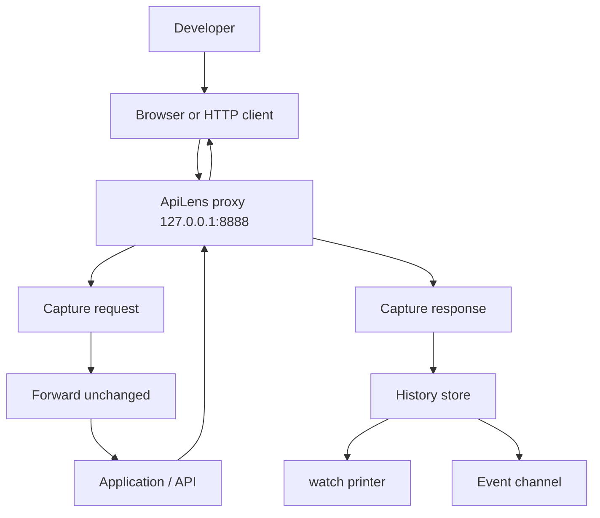
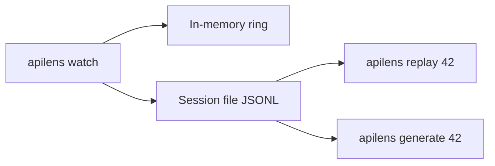
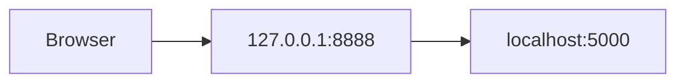
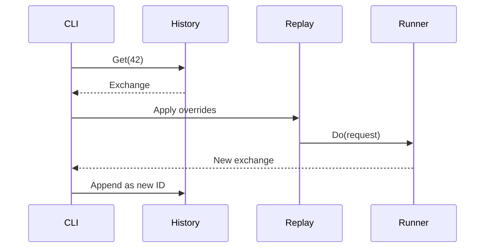
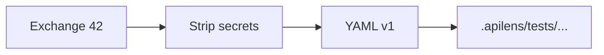

# 08 — Runtime proxy, history, replay

Runtime monitoring is the product differentiator. It is **designed now** and **implemented in Phase 3**, after the HTTP runner is stable.

The proxy is a local forward proxy. It does not rewrite requests unless the user opts into modification (none in MVP).

## 1. Traffic path



The proxy is a tap, not a debugger that mutates traffic.

## 2. Why a proxy

| Approach | Notes |
| --- | --- |
| Forward HTTP proxy | **Chosen.** Works for browsers and curl via `HTTP_PROXY`. |
| Reverse proxy in front of the API | Useful later as `apilens watch --upstream`. Not the default. |
| Browser extension | Powerful, heavy, Phase 5+ |
| In-process Node/Go agent | Framework-specific, conflicts with "don't execute the app" |
| OS packet capture | Privileged, fragile, overkill |

Default: forward proxy on loopback.

Optional later: reverse-proxy mode for apps that cannot set `HTTP_PROXY` (some HTTP/2, some mobile).

## 3. Bind and process model

```text
Listen: 127.0.0.1:8888
Flag:   --bind, --port
Refuse: 0.0.0.0 / :: / LAN addresses unless --allow-remote
```

`--allow-remote` is a conscious unsafe switch. Print a warning. Default off.

`watch` blocks the terminal. History lives in that process.

### Cross-terminal replay

A second terminal needs IDs while watch is running.



Phase 3 session file:

```text
$APILENS_HISTORY_FILE   or
<project>/.apilens/history/session.jsonl
```

Watch writes JSONL (already redacted). `replay` / `generate` / `history` / `apilens ui` read the file if in-memory is empty. Watch also publishes that path to `$TMPDIR/apilens-current-history` so `apilens ui` started from a different repo (for example Stance frontend vs API) still lists the same hits. `$APILENS_HISTORY_POINTER` overrides the pointer file.

The file is 0600. Starting `watch` again truncates it (new session, display IDs restart at #1). Ctrl+C keeps the file for `history` / `generate` until the next watch.

## 4. Capture record

```text
Exchange
  DisplayID     42
  UUID
  Method
  URL
  RequestHeaders    # redacted
  RequestBody       # redacted / truncated
  Status
  ResponseHeaders   # redacted
  ResponseBody      # redacted / truncated
  Duration
  Timestamp
  Truncated         bool
  Redacted          bool
```

`max_response_size` default: 5MB. Over that: store prefix + `Truncated=true`.

Request bodies use the same cap.

## 5. TLS / HTTPS

MVP default: **no MITM**.

| Traffic | Behavior |
| --- | --- |
| HTTP | Captured fully |
| HTTPS CONNECT | Tunnel only — method/path inside TLS not visible |
| HTTPS with `--mitm` | Later. Local CA, user-installed, opt-in |

Document this honestly. Many local dev APIs are HTTP (`localhost:5000`). Many frontends call `https://` even locally.

Phase 3 success criteria can be met with HTTP apps and with reverse-proxy mode (`apilens watch --upstream http://localhost:5000`) where the browser hits `http://127.0.0.1:8888` and ApiLens forwards to the app. That captures HTTPS-less local traffic without a CA.



Ship forward-proxy first. Add `--upstream` in the same phase if it stays small. MITM is Phase 3.1 or 4.

## 6. Filtering

```text
apilens watch --filter /api
apilens watch --host localhost
```

Drop noise: `GET /favicon.ico`, static assets by extension (`.js`, `.css`, `.map`, `.png`) unless `--all`.

Config:

```yaml
watch:
  ignore_extensions: [js, css, map, png, jpg, svg, woff2]
  path_prefix: /api          # optional
```

## 7. Watch UI in the terminal

```text
API WATCHER

Listening on 127.0.0.1:8888
HTTP_PROXY=http://127.0.0.1:8888
History: .apilens/history/session.jsonl
Ctrl+C stops watch and keeps the session file until reboot.

#1  GET        /api/profile                    200   81ms
#2  QUERY      ping                            200   12ms
#3  MUTATION   login                           200*  90ms
```

`--verbose` prints redacted headers after each line. Default is one line per exchange. Consecutive identical GraphQL operations (same `QUERY`/`MUTATION` + name + status) collapse to one line plus `(×N same)`. GraphQL prints `QUERY`/`MUTATION` and the operation name instead of `POST /graphql`. `200*` means HTTP 200 with `errors[]` in the GraphQL envelope. An unreadable session file is an error on `history list` / `history show`, not an empty list.

## 8. Replay



Replay always creates a **new** history ID. It does not overwrite #42.

Overrides from flags are applied after the stored request is reconstructed. Stored secrets may already be redacted — replay of a masked `Authorization: Bearer ********` must fail with a clear error: use `--env` auth or `--header`. Do not send the literal asterisks.

## 9. Generate



Path default:

```text
.apilens/tests/generated/<method>-<slug-path>.yaml
```

Example: `POST /api/forms` → `generated/post-api-forms.yaml`.

`--out` overrides. Refuse overwrite without `--force`.

## 10. Latency budget

The proxy should add very little delay: read request, tee body up to cap, `RoundTrip`, tee response, return.

Do not pretty-print JSON on the hot path. Do not write pretty YAML per request. JSONL append is enough.

## 11. What the proxy will not do in MVP

- Rewrite hosts or inject headers (except later explicit debug flags)
- Block requests
- Serve mocks
- Decode WebSockets beyond the upgrade line
- Capture HTTP/3
- Install a system CA automatically

Mocks, rewriting, and page-to-API mapping are future product features, not proxy requirements for Phase 3.
