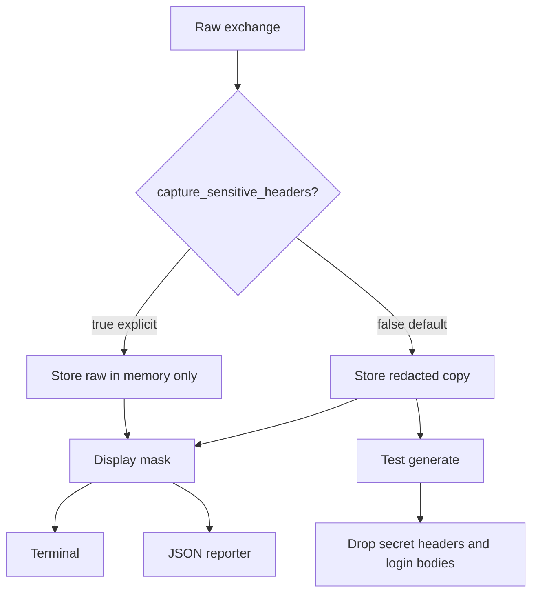
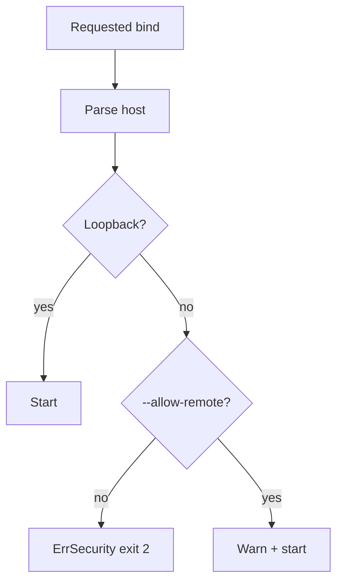

# 09 — Security model

Security is a core package, not a reporter afterthought. Every path that prints, stores, or generates files runs through `internal/security`.

## 1. Principles

1. Secrets are not logged by default.
2. Secrets are not persisted by default.
3. The proxy listens on loopback by default.
4. Redaction cannot be bypassed by `--verbose`.
5. Generated tests must be safe to commit.
6. Fail closed on missing secret variables.

## 2. What counts as sensitive

### Headers (always masked in display)

- `Authorization`
- `Proxy-Authorization`
- `Cookie`
- `Set-Cookie`
- `X-API-Key`, `X-Api-Key`, `Api-Key`, `X-Api-Token`
- `X-Auth-Token`, `X-Access-Token`
- `X-CSRF-Token`, `X-CSRFToken`
- `X-Session-ID` / `X-Session-Id`

Config can add names:

```yaml
security:
  capture_sensitive_headers: false
  sensitive_headers:
    - X-Custom-Token
```

Matching is case-insensitive.

### Body fields (JSON object keys, case-insensitive)

- `password`, `passwd`, `secret`, `token`
- `access_token`, `refresh_token`, `id_token`
- `api_key`, `apikey`, `client_secret`
- `authorization`, `credit_card`, `ssn`

If a JSON body contains any of these keys, history stores a redacted copy (values replaced with `********`) when persistence/display happens. Generate **drops the body** for those payloads.

### Query parameters

Same key list as body fields: `?token=`, `?api_key=` are masked in display and history.

## 3. Redaction pipeline



Even when `capture_sensitive_headers: true`:

- terminal/JSON reports still mask
- generate still drops secrets
- verbose logs still mask
- the value is only available for replay in the same process

JSON test reports used in CI must never include raw `Authorization` values.

## 4. Display format

```text
Authorization: Bearer ********
Cookie: ********
Set-Cookie: ********
X-API-Key: ********
```

Do not show prefix lengths that leak token shape beyond the scheme name (`Bearer`). Basic auth becomes `Basic ********`.

## 5. Proxy bind policy



Loopback: `127.0.0.1`, `localhost`, `::1`.

Default listen: `127.0.0.1:8888` — IPv4 loopback only, not `""` (which means all interfaces in Go).

## 6. Session history file

If a session JSONL file is used:

- mode `0600`
- directory must be the user temp dir or `.apilens/history/` (gitignored)
- contents already redacted
- do not put it in the repo
- `init` adds ignore rules

## 7. Environment secrets

```yaml
# .apilens/environments/staging.yaml
base_url: https://staging.example.com
variables:
  token: "${AUTH_TOKEN}"
```

Never:

```yaml
token: eyJhbGciOi...    # forbidden by policy and by review
```

`init` templates use `${AUTH_TOKEN}`. Docs and examples use placeholders.

`<env>.secrets.yaml` is gitignored and merged at load time after `<env>.yaml`. Example: `.apilens/environments/local.secrets.yaml` overlays `local.yaml`. `apilens env show` still redacts secret-looking keys (token, password, …) even when the value came from the secrets file. A missing `AUTH_TOKEN` at interpolate time names that file in the error.

## 8. What we do not do

- We do not upload captures anywhere.
- We do not open a cloud account in the CLI.
- We do not disable TLS verification by default.
- We do not auto-install a root CA.
- We do not print request bodies in `run` unless `--verbose` and the body is non-sensitive.
- We do not implement secret scanning of the whole repo (nice later, not MVP).

## 9. Threat notes (honest)

| Risk | Mitigation |
| --- | --- |
| Token in terminal scrollback | Mask display |
| Token in CI logs | JSON reporter uses display headers |
| Token in generated YAML | Drop on generate |
| Token in watch session file | File is redacted + 0600 |
| Proxy exposed on LAN | Bind policy |
| MITM CA abuse | MITM off by default, user-installed CA later |
| User sets `capture_sensitive_headers: true` | Still mask in reports; warn in docs |

ApiLens runs as the developer. It cannot protect a user who pastes a token into a test file. It can refuse to do that automatically.

## 10. Config defaults

```yaml
security:
  capture_sensitive_headers: false
  sensitive_headers: []
  max_response_size: 5MB
  proxy_allow_remote: false
```

These defaults are part of the product, not suggestions.
