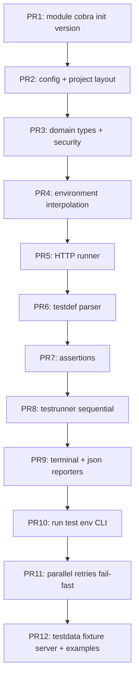

# 10 — MVP implementation plan

Product releases v1–v10 live in [plan.md](../plan.md). This file is the **v1 engineering sequence** only.

No application code until this pack is reviewed.

Build the **engine and CLI runner first**. Discovery and watch are worthless if `run` is untrustworthy.

## 1. Phase map

```mermaid
gantt
    title ApiLens phases
    dateFormat X
    axisFormat %s

    section Phase1
    Skeleton config init           :p10, 0, 1
    Domain security env            :p11, 1, 2
    HTTP runner                    :p12, 2, 3
    Test DSL assertions            :p13, 3, 4
    Test runner reporters CLI      :p14, 4, 5

    section Phase2
    OpenAPI registry list inspect  :p20, 5, 6
    Express provider               :p21, 6, 7

    section Phase3
    Proxy history watch            :p30, 7, 8

    section Phase4
    Replay generate                :p40, 8, 9

    section Phase5
    Web UI                         :p50, 9, 10

    section Phase6
    JUnit CI docs                  :p60, 10, 11
```



The X axis is sequence, not calendar. Phase 1 is the only phase that must exist before the tool is useful to a QA engineer with hand-written tests.

## 2. Phase 1 — Foundation

**In:**

- Go module, `cmd/apilens`, Cobra skeleton
- `apilens init`, `version`
- `config.yaml` load + validate
- Environment files + `{{var}}` + `${ENV}`
- Security redactor (used by reporters from day one)
- HTTP runner
- YAML test DSL v1
- Assertion engine (MVP kinds)
- Test runner: sequential, then parallel, retries, timeout
- Terminal reporter
- JSON reporter
- `apilens run`, `apilens test <file>`, `apilens env`
- Exit codes 0 / 1 / 2

**Out:**

- Web UI
- Proxy / watch
- OpenAPI (unless a thin import falls out naturally — do not block on it)
- Express
- Replay / generate
- JUnit
- Plugin RPC

**Phase 1 done when:**

```text
apilens init
# author a YAML test
AUTH_TOKEN=dev apilens run --env local
echo $?    # 0 or 1
apilens run --format json
```

## 3. Phase 2 — Discovery

- Provider port + host wiring
- OpenAPI provider
- Registry + optional `registry.yaml`
- `discover`, `list`, `inspect` (spec view)
- `inspect --live` probe via runner
- Express provider (conservative)

**Done when:** `apilens discover` on an OpenAPI fixture prints endpoints, and `list` works in a new process.

## 4. Phase 3 — Capture

- Loopback forward proxy
- Optional `--upstream` reverse mode if small
- History ring + session JSONL
- `watch`, `history list|show`
- Endpoint upsert from observed traffic
- Size limits + redaction on capture

**Done when:** a local HTTP app proxied through ApiLens prints `#1 GET /api/... 200`.

HTTPS MITM is not required to close Phase 3.

## 5. Phase 4 — Replay and generate

- `replay` with overrides
- Refuse replay of masked auth without new credentials
- `generate` to YAML v1
- `test /api/users` path matching

**Done when:** watch → generate → run works on one captured call.

## 6. Phase 5 — Web UI

- `apilens ui` local server
- Same Engine methods
- Explorer, request builder, history, monitor, results

No new assertion or HTTP libraries in the frontend.

## 7. Phase 6 — CI/CD

- JUnit reporter
- GitHub Actions example
- Document exit codes
- `--quiet` / machine-friendly logs

JSON + exit codes already exist from Phase 1. Phase 6 packages them.

## 8. Phase 1 implementation order (PRs)

Small reviewable PRs. Each leaves `main` buildable.



Do not start PR5 and PR6 in isolation from domain types — PR3 is the contract.

## 9. Suggested first libraries

Keep the list short.

| Need | Library | Notes |
| --- | --- | --- |
| CLI | `spf13/cobra` | Standard |
| YAML | `gopkg.in/yaml.v3` | DSL + config |
| OpenAPI (P2) | `getkin/kin-openapi` | Do not vendor a parser |
| HTTP | stdlib `net/http` | Enough for MVP |
| Proxy (P3) | stdlib or `elazarl/goproxy` | Prefer stdlib forward proxy first |
| Colors | none or `fatih/color` | Terminal reporter can be plain first |

No ORM. No web framework in Phase 1. No cobra-generator.

## 10. Definition of "core is stable"

Before Phase 3 starts:

- [ ] `run` is deterministic on testdata
- [ ] Parallel tests do not share mutable request structs
- [ ] Redaction tests exist
- [ ] Exit codes are covered
- [ ] JSON report schema is documented
- [ ] Engine methods exist even if some return `ErrNotImplemented` for watch/replay

Returning `ErrNotImplemented` from unused Engine methods is fine. Putting watch logic in the CLI is not.

## 11. Staffing the work

One engineer can land Phase 1 sequentially. Parallelism that helps after PR3:

- Person A: runner + testrunner
- Person B: DSL + assertions + reporters

Discovery providers are independent after the port exists.

## 12. After review

If this pack is approved, the first code change is PR1 only:

- `go.mod`
- `cmd/apilens` with `version` and a stub `init`
- `.gitignore`
- no features

Then stop and implement PR2. Resist boiling the ocean in one commit.
