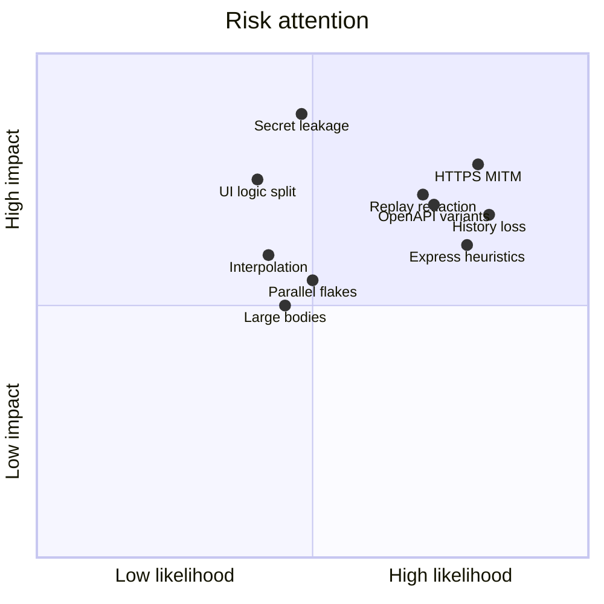

# 11 — Risks and specification gaps

Reviewed against the product spec. Each gap has a **proposed default** so implementation is not blocked by silence. Reject or amend during review.

## 1. Technical risks

| ID | Risk | Impact | Likelihood | Mitigation |
| --- | --- | --- | --- | --- |
| R1 | OpenAPI 2 vs 3 + broken specs | Discover fails or misses routes | High | Use `kin-openapi`; skip + report file-level errors; do not abort the whole run if one spec is bad **unless** `--path` pointed at it |
| R2 | Express discovery is heuristic | False negatives, rare false positives | High | Conservative extract; never invent; OpenAPI remains source of truth |
| R3 | HTTPS capture needs MITM | Watch looks "broken" on HTTPS apps | High | HTTP + optional `--upstream` for Phase 3; MITM explicit later; document limits |
| R4 | Secret leakage in logs/CI | Security incident | Medium | Redactor on all outputs; tests for reporter JSON |
| R5 | In-memory history vanishes | Cannot generate after Ctrl+C | High | Session JSONL in Phase 3; banner explains it |
| R6 | Parallel tests sharing state | Flaky suites | Medium | Deep copy interpolated requests; no global HTTP client mutation |
| R7 | Large responses | Memory spikes | Medium | `max_response_size`; truncate flag |
| R8 | Variable interpolation edge cases | Accidental literal `{{token}}` sent | Medium | Fail closed |
| R9 | HTTP/2, HTTP/3, WebSocket | Incomplete capture | Medium | HTTP/1.1 first; WS upgrade logged only |
| R10 | Cookie/session replay after redact | Replay fails confusingly | High | Explicit error; require env auth |
| R11 | Path-param clustering (`/users/1`) | Registry spam from watch | Medium | Do not cluster in MVP |
| R12 | Monorepo walk | Discover is slow | Medium | Depth limit + ignore dirs |
| R13 | Go plugin `.so` temptation | Portability failure | Low | Forbidden — compile-time only |
| R14 | Duplicate logic in a future UI | Divergent products | Medium | Engine facade + review rule |
| R15 | goproxy / CA complexity | Phase 3 slips | Medium | Stdlib proxy first |
| R16 | Test path matching ambiguity | Wrong tests run | Medium | `--method`; match rules documented |
| R17 | JSON reporter leaking bodies | CI log secrets | Medium | Same redactor; bodies off by default in JSON summary |



## 2. Specification gaps and proposed defaults

### G1 — `inspect` without a captured request

**Gap:** Spec shows headers, body, response, timing. That requires a live call or history.

**Default:** `inspect` shows registry spec. `--live` executes. `--last` shows history.

### G2 — `apilens test /api/users` vs multiple methods

**Gap:** GET and POST may both exist.

**Default:** Run all tests whose request path matches. `--method` filters. If the ref is a file, run that file.

### G3 — No tests for that path

**Gap:** Does `test` probe the API anyway?

**Default:** Exit 2. Hint to write YAML or `generate`. `inspect --live` is the probe.

### G4 — How OpenAPI files are found

**Default:** Config paths → well-known names → depth-4 walk with ignores. See [07-discovery.md](07-discovery.md).

### G5 — How the browser reaches the proxy

**Gap:** Spec does not say how to attach.

**Default:** Document `HTTP_PROXY` / `HTTPS_PROXY`. No auto browser launch in Phase 3. Optional `--upstream` reverse mode.

### G6 — History across processes

**Default:** In-memory + session JSONL while watch runs. No durable DB in MVP.

### G7 — Display IDs after restart

**Default:** IDs are session-scoped. Do not promise `#42` forever.

### G8 — GraphQL, WebSocket, gRPC

**Default:** GraphQL-over-HTTP is in scope (`request.graphql`, `assert.graphql`, SDL discovery, watch/generate of GraphQL POST bodies). WebSocket subscriptions and gRPC are out of scope. HTTP/1.1 REST/JSON remains the other supported transport.

### G9 — Multipart / file uploads

**Default:** Out of Phase 1–4. Raw body may still be sent if the user writes it.

### G10 — `base_url` in both config and env file

**Default:** Environment file wins over `config.server.base_url`. Flags and `APILENS_BASE_URL` win over both.

### G11 — Auth on generated tests

**Default:** Structured `auth` is not copied from capture. User attaches env auth.

### G12 — Test naming and folders

**Default:** Recursive `**/*.yaml`. One test per file. Tags optional.

### G13 — Parallel default

**Spec:** `testing.parallel: true`.

**Default:** Honor config. CLI `--sequential` overrides. Worker count = `GOMAXPROCS` unless `testing.workers` set.

### G14 — Retry meaning

**Default:** Transport errors only. Assertion failures do not retry.

### G15 — Success percent

**Default:** `passed / (passed + failed + errored)`. Skipped excluded from the denominator.

### G16 — `run` with zero tests

**Default:** Exit 2 (`ErrConfig`) — likely a mistake after `init`.

### G17 — Windows paths and proxy env

**Default:** Support Windows; proxy env vars are standard. Phase 1 tests on Unix first.

### G18 — Plugin loading from disk

**Gap:** Spec says "plugins" without a mechanism.

**Default:** Compile-time registration. No user `plugins/` directory in MVP.

### G19 — Page-to-API mapping

**Spec future feature.** Watch does not know which HTML page triggered a call unless we have a browser extension.

**Default:** Deferred. Do not fake it from `Referer` in MVP (unreliable).

### G20 — `inspect` output of binary bodies

**Default:** Show type, length, and skip hex dumps unless `--verbose`.

### G21 — Multiple OpenAPI `servers`

**Default:** Ignore for execution. `base_url` is authoritative.

### G22 — Filtering discovered APIs

**Default:** `list --method --tag`. `discover` has no deny-list in MVP beyond walk ignores.

### G23 — Contract vs example tests from OpenAPI

**Default:** Discover only. Do not auto-write tests from examples in Phase 2.

### G24 — Watch exit code

**Default:** 0 on clean Ctrl+C. 2 if bind failed.

### G25 — JSON report schema

**Gap:** Spec shows terminal, not JSON shape.

**Default:**

```json
{
  "version": 1,
  "env": "local",
  "counts": {"tests": 4, "passed": 3, "failed": 1, "errored": 0, "skipped": 0},
  "success_percent": 75,
  "duration_ms": 534,
  "results": [
    {
      "name": "Get User",
      "file": ".apilens/tests/users/get-user.yaml",
      "status": "failed",
      "method": "GET",
      "url": "http://localhost:5000/api/users/1",
      "http_status": 500,
      "duration_ms": 218,
      "assertions": [
        {"kind": "status.equals", "passed": false, "expected": "200", "actual": "500"}
      ]
    }
  ]
}
```

No raw headers or bodies in the default JSON report. `--verbose` may add redacted headers.

## 3. Product-scope tensions

The spec wants a differentiator (watch) and an MVP that is mostly a test runner. That is correct **if** the engine is shared. The risk is building watch before assertions are solid, or building a request-builder UI that forks the runner.

Phase gates exist to prevent both.

## 4. Decisions needed from review

Please explicitly accept or change:

1. Compile-time plugins only
2. `inspect` spec-first, `--live` for traffic
3. `test` never implicit-probes
4. No HTTPS MITM in Phase 3
5. Session JSONL for cross-terminal replay
6. Dotted JSON paths, not full JSONPath
7. One test per YAML file
8. Fail closed on missing variables
9. JSON reports omit bodies by default
10. Phase 1 cut line (no discover required)

If these ten are approved, implementation can start at PR1.
