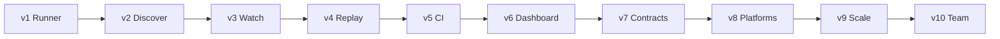

# ApiLens product plan — v1 to v10

This is the **product release roadmap**.

- Engineering sequence for the first runner: [docs/10-plan.md](docs/10-plan.md)
- Architecture: [docs/01-architecture.md](docs/01-architecture.md)
- Risks and open gaps: [docs/11-risks-and-gaps.md](docs/11-risks-and-gaps.md)

No application code until v1 PR1 is approved. Versions below are **product releases**, not weekly sprints. A version ships only when its success criteria are true.



| Version | Name | Who it unblocks | One-line outcome |
| --- | --- | --- | --- |
| **v1** | Runner | Developers, QA | Write YAML tests and `apilens run` |
| **v2** | Discover | Developers | See APIs that exist in the project |
| **v3** | Watch | Developers | See APIs a running page actually calls |
| **v4** | Replay | Developers, QA | Capture → replay → generate a test |
| **v5** | CI | DevOps | Exit codes, JUnit, GitHub Actions |
| **v6** | Dashboard | Developers, QA | Local web UI on the same engine |
| **v7** | Contracts | QA, platform | Schema, OpenAPI out, contract tests |
| **v8** | Platforms | Multi-stack teams | More frameworks, mocks, API graphs |
| **v9** | Scale | QA, performance | Load, recording, smarter generation |
| **v10** | Team | Orgs | Remote runs, collaboration, cloud |

Rules that never change:

1. CLI first. UI is an adapter.
2. One Go engine. No second test runner.
3. Secrets masked and not persisted by default.
4. Discovery stays a first-class feature.
5. Keep each version small enough to ship.

---

## Current repo vs what each version adds

Present today (planning only):

```text
ApiLens/
├── README.md
├── plan.md
├── CHANGELOG.md
├── .gitignore
├── docs/                    # architecture pack
├── architecture/            # PNG diagrams only
├── mermaid-diagrams/        # .mmd sources
├── examples/                # placeholders until v1
└── testdata/                # placeholders until v1
```

Still missing on purpose — created when that version starts, not before:

| Path | First appears |
| --- | --- |
| `go.mod`, `cmd/apilens`, `internal/*`, `pkg/apilens` | v1 |
| `LICENSE` | v1 (choose license at first commit) |
| `.github/workflows/` | v5 |
| `web/dashboard/` | v6 |
| `internal/discovery/providers/*` beyond OpenAPI/Express | v8 |
| Cloud / remote worker services | v10 |

Do not create empty `internal/` packages now. Empty Go trees rot and invite premature code.

---

## v1 — Runner

**Goal:** A QA engineer can author YAML tests and run them from the terminal.

**Users:** Developers, QA.

### Ships

- `apilens init`, `version`, `env list|use|show`
- `apilens run`, `apilens test <file>`
- Config, environments, `{{var}}` and `${ENV}`
- HTTP runner, retries, timeout, sequential then parallel
- Assertions: status, headers, body, dotted JSON, duration
- Terminal + JSON reporters
- Exit codes `0` / `1` / `2`
- Security redactor on all output

### Does not ship

- `discover`, `watch`, `replay`, `generate`
- Web UI, JUnit, OpenAPI, Express

### Success

```text
apilens init
AUTH_TOKEN=dev apilens run --env local
echo $?          # 0 or 1
apilens run --format json
```

### Folders created

```text
cmd/apilens/
internal/{domain,app,cli,config,project,runner,testdef,
          assertions,testrunner,environment,security,
          reporter,auth,plugins}
pkg/apilens/
examples/httpbin-or-fixture/
testdata/
```

Engineering PR order: [docs/10-plan.md](docs/10-plan.md) section 8.

---

## v2 — Discover

**Goal:** A developer can see which APIs exist without typing them by hand.

### Ships

- Discovery plugin port + host
- OpenAPI 3 / Swagger 2 provider
- Registry cache (`.apilens/api/registry.yaml`)
- `apilens discover`, `list`, `inspect`
- `inspect --live` uses the v1 runner
- Express provider (conservative source scan)

### Does not ship

- Watch, replay, generate
- Every web framework
- Auto-writing tests from OpenAPI examples

### Success

```text
apilens discover
apilens list
apilens inspect /api/users
```

Prints method + path. `list` works in a new process.

---

## v3 — Watch

**Goal:** Open a local app and see the APIs that page actually calls.

### Ships

- Loopback forward proxy (`127.0.0.1:8888`)
- Optional `--upstream` reverse mode
- In-memory history + redacted session JSONL
- `apilens watch`, `history list|show`
- Observed endpoints upserted into the registry
- Capture size limits and redaction

### Does not ship

- HTTPS MITM
- Browser extension
- Page-to-API mapping
- Durable history database

### Success

```text
apilens watch
# HTTP_PROXY=http://127.0.0.1:8888
# open the app
#1  GET  /api/profile    200   81ms
```

---

## v4 — Replay

**Goal:** The differentiator loop is closed: watch → inspect → replay → generate → run.

### Ships

- `apilens replay <id>` with URL / method / header / body overrides
- Refuse replay of masked `Authorization` without env credentials
- `apilens generate <id>` → YAML v1
- `apilens test /api/users` path matching

### Does not ship

- Chained tests (`{{response.0.id}}`)
- Multi-test YAML files
- AI generation

### Success

```text
apilens generate 42
apilens run
```

A captured call becomes an editable test and passes or fails for a real reason.

---

## v5 — CI

**Goal:** A pipeline can run the suite and fail the build.

v1 already has JSON + exit codes. v5 packages them for machines.

### Ships

- JUnit XML reporter
- `apilens run --format junit`
- `--quiet`, `--fail-fast` documented for CI
- GitHub Actions example
- Example GitLab job (docs only if no extra code)

### Does not ship

- Hosted runners
- Cloud dashboard
- GitHub Check annotations as a product (nice-to-have, not required)

### Success

```yaml
- run: apilens run --env staging --format junit --quiet
```

Exit `1` on failed tests, `2` on config errors. CI consumes JUnit or JSON.

**Folders created:** `.github/workflows/apilens-example.yml` (example, or docs snippet).

---

## v6 — Dashboard

**Goal:** Optional local UI. Same engine. No second product.

### Ships

- `apilens ui` — localhost only
- API Explorer
- Request builder
- History
- Runtime monitor
- Test suites and results
- Environment switcher

### Does not ship

- Accounts, multi-user, remote hosting
- A TypeScript HTTP client that reimplements assertions

### Success

Every UI action is an Engine method that the CLI can already perform.

**Folders created:** `web/dashboard/` (static or small frontend). Go serves it. Business logic stays in `pkg/apilens`.

---

## v7 — Contracts

**Goal:** Tests can enforce shape, not only status codes. Captures can become specs.

### Ships

- JSON Schema assertions
- OpenAPI generation from registry + captures
- Contract testing against a stored spec
- Richer JSON path / regex assertions
- Array length assertions

### Does not ship

- Full Pact broker
- GraphQL schema testing

### Success

A breaking response-field change fails `apilens run` with a schema assertion. `apilens spec export` writes an OpenAPI file the team can review.

---

## v8 — Platforms

**Goal:** Discovery works on more stacks. Teams can mock and see API relationships.

### Ships

- Framework providers: Fastify, NestJS, Gin, Fiber, Echo (then Spring / Django / ASP.NET as follow-ups)
- API mocking (`apilens mock`) using registry + captured examples
- API dependency graphs
- Page-to-API mapping (Referer is not enough — needs watch metadata or a later extension)
- Test tags, suites, and ignore filters at discover time

### Does not ship

- Cloud mock hosting
- Every framework on day one of v8 — ship providers incrementally under the same major if needed (`v8.1` Gin, `v8.2` Spring)

### Success

A Gin or Express repo without OpenAPI still `discover`s routes. A frontend can hit `apilens mock` when the real API is down.

---

## v9 — Scale

**Goal:** ApiLens can generate more tests and apply load without becoming a separate load-test company.

### Ships

- Load / soak mode (`apilens run --load` or `apilens load`) on the same runner
- Test recording sessions
- Response chaining in DSL v2 (`{{responses.login.body.token}}`)
- Database assertions (opt-in plugin)
- AI-assisted generation (optional, local or user-supplied key — never default-on, never send secrets)
- Automatic test generation from OpenAPI examples (now that v7 contracts exist)

### Does not ship

- Distributed load grid
- Mandatory AI cloud

### Success

A recorded flow becomes a chained suite. A smoke suite can also run as a bounded load pass with p95 reported.

---

## v10 — Team

**Goal:** Orgs can share suites and run them remotely. The engine is still the v1 engine.

### Ships

- Team collaboration on suites (git remains source of truth; optional remote index)
- Remote test execution workers
- Cloud / hosted dashboard (optional product)
- GitHub and GitLab integrations (PR comments, checks)
- Org-level environment secrets (never in git)
- Audit log of remote runs

### Does not ship in v10

- Replacing git with a proprietary test database as the only store
- A hosted runner that uses different assertion semantics than the CLI

### Success

`apilens run` locally and a PR check remotely produce the same pass/fail for the same YAML and env.

---

## Version mapping to the original spec

| Spec phase | Product version |
| --- | --- |
| Phase 1 Foundation | **v1** |
| Phase 2 Discovery | **v2** |
| Phase 3 Request capture | **v3** |
| Phase 4 Replay and generation | **v4** |
| Phase 6 CI/CD | **v5** (moved ahead of UI so CI works without a browser) |
| Phase 5 Web UI | **v6** |
| Schema, OpenAPI out, contract testing | **v7** |
| More frameworks, mock, graphs, page mapping | **v8** |
| Load, recording, AI, DB assertions | **v9** |
| Team, remote, cloud, GitHub/GitLab | **v10** |

CI is **v5**, UI is **v6**. A pipeline should not wait on a dashboard.

---

## What is never a version by itself

These are cross-cutting and land inside the version that first needs them:

| Concern | Lands in |
| --- | --- |
| Redaction / bind policy | v1, enforced in v3+ |
| Plugin host | v1 (reporters/auth), used by v2+ |
| Engine facade | v1, frozen enough for v6 |
| DSL versioning | v1 = YAML v1, v9 = YAML v2 chaining |
| Windows support | v1 best-effort, v5 must work in CI images |

---

## Release hygiene

Each major version:

1. Updates [CHANGELOG.md](CHANGELOG.md)
2. Tags `vN.0.0`
3. Keeps `apilens version` accurate
4. Does not break YAML v1 tests (additive DSL only until a documented v2)
5. Adds or updates an example under `examples/`

Patch releases (`vN.0.x`) are fixes only. Minor releases (`vN.x.0`) add features that fit the same product name (for example extra discovery providers inside v8).

---

## Suggested calendar (not a commitment)

Sequence matters more than dates. If one person builds this:

| Version | Rough effort after the previous ships |
| --- | --- |
| v1 | 3–5 weeks |
| v2 | 2–3 weeks |
| v3 | 2–3 weeks |
| v4 | 1–2 weeks |
| v5 | 1 week |
| v6 | 4–6 weeks |
| v7 | 3–4 weeks |
| v8 | 6–10 weeks (providers are the long pole) |
| v9 | 4–8 weeks |
| v10 | product + infra, not a single sprint |

v1–v5 is the **core product**. v6–v10 is expansion. Do not start v6 until v4 success criteria are true and v5 is usable in CI.

---

## Next action

1. Review this roadmap and [docs/README.md](docs/README.md) locks.
2. When approved, start **v1 PR1** only: `go.mod`, `cmd/apilens` (`version` + stub `init`), no features.
3. Do not scaffold v6–v10 folders now.
